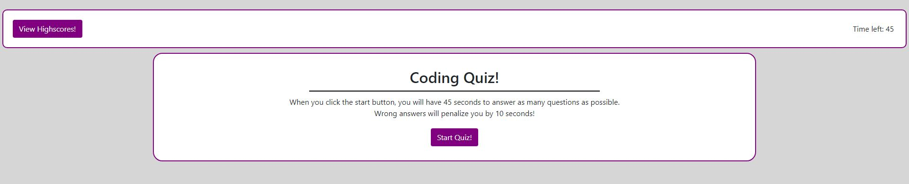

# Code Quiz README
This repository contains code for my coding quiz challenge. When the user clicks the 'Start Quiz' button on the landing page, a timer starts and the quiz begins. The user can click different buttons to answer questions for the quiz and save their score at the end. Score are saved to the users local-storage file and can be retrieved via the View High Scores button.
## Languages
- HTML
- CSS
- JavaScript
## Snapshot
